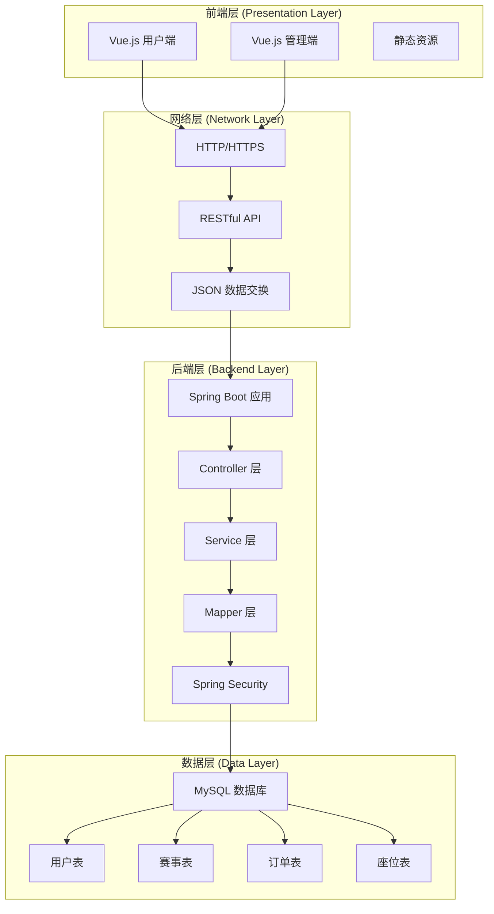
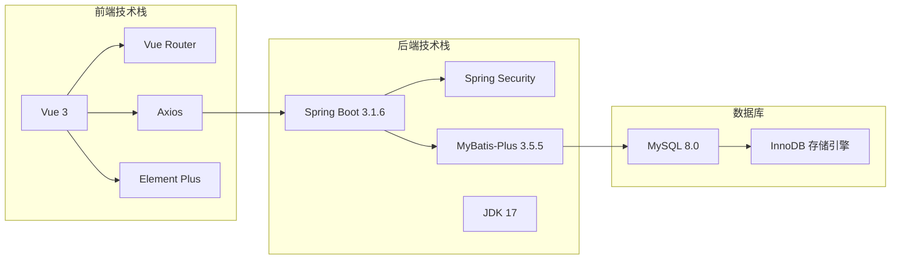
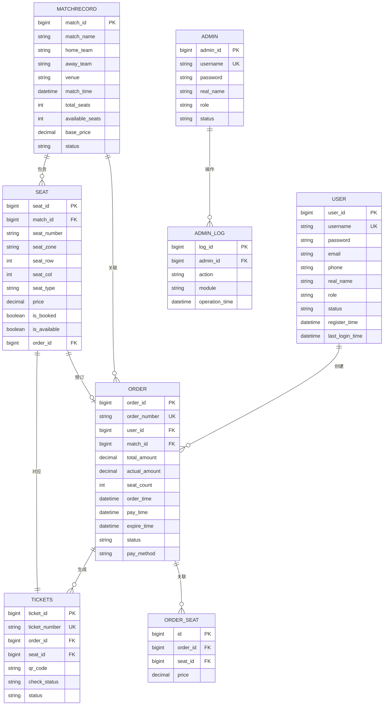
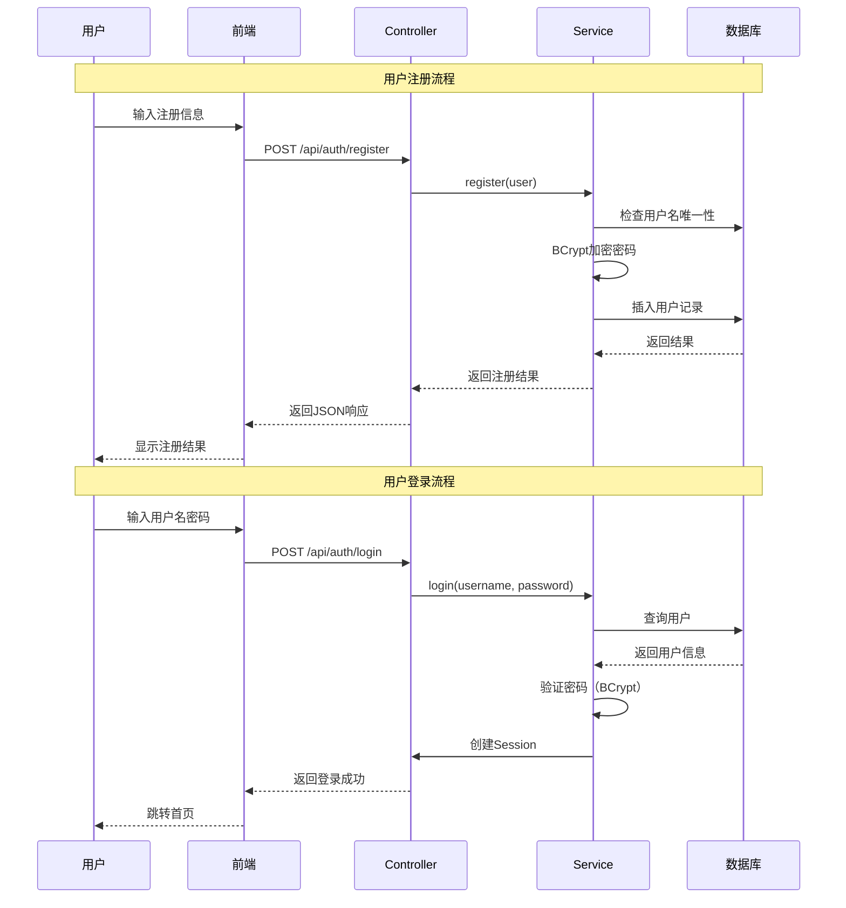

# 系统架构图和ER图

## 一、系统总体架构图

### 1.1 系统架构图（文本版）

```
┌─────────────────────────────────────────────────────────────┐
│                        用户浏览器                             │
│  ┌──────────────┐  ┌──────────────┐  ┌──────────────┐      │
│  │  用户端页面   │  │  管理端页面   │  │   静态资源    │      │
│  │  (Vue.js)    │  │  (Vue.js)    │  │  (CSS/JS)    │      │
│  └──────┬───────┘  └──────┬───────┘  └──────┬───────┘      │
└─────────┼─────────────────┼─────────────────┼──────────────┘
          │                 │                 │
          │  HTTP/RESTful API (JSON)          │
          │                 │                 │
┌─────────▼─────────────────▼─────────────────▼──────────────┐
│              Spring Boot 后端服务                            │
│  ┌──────────────┐  ┌──────────────┐  ┌──────────────┐      │
│  │ Controller层 │  │  Service层   │  │   Mapper层   │      │
│  │  (API接口)   │  │  (业务逻辑)  │  │  (数据访问)  │      │
│  └──────┬───────┘  └──────┬───────┘  └──────┬───────┘      │
│         │                 │                 │               │
│  ┌──────▼─────────────────▼─────────────────▼───────┐      │
│  │         Spring Security (安全认证)                │      │
│  └───────────────────────────────────────────────────┘      │
└─────────┬───────────────────────────────────────────────────┘
          │
          │ JDBC/MyBatis-Plus
          │
┌─────────▼───────────────────────────────────────────────────┐
│                  MySQL 数据库                                │
│  ┌──────────┐  ┌──────────┐  ┌──────────┐  ┌──────────┐   │
│  │ user表   │  │ order表  │  │ seat表   │  │match表   │   │
│  └──────────┘  └──────────┘  └──────────┘  └──────────┘   │
│  ┌──────────┐  ┌──────────┐  ┌──────────┐  ┌──────────┐   │
│  │tickets表 │  │admin表   │  │admin_log │  │config表  │   │
│  └──────────┘  └──────────┘  └──────────┘  └──────────┘   │
└─────────────────────────────────────────────────────────────┘
```

### 1.2 系统架构图（Mermaid格式）



### 1.3 技术架构图



## 二、数据库ER图

### 2.1 ER图（Mermaid格式）



### 2.2 ER图（文本版）

```
┌─────────────┐         ┌──────────────┐
│    user     │────────<│    orders    │
│  (用户表)   │  1:N    │  (订单表)    │
└─────────────┘         └──────────────┘
                               │
                               │ 1:N
                               │
┌──────────────┐      ┌──────────────┐      ┌──────────────┐
│ matchrecord  │───1:N<│     seat     │───1:1>│   tickets    │
│  (赛事表)    │      │  (座位表)    │      │  (电子票表)  │
└──────────────┘      └──────────────┘      └──────────────┘
       │                    │                        │
       │                    │                        │
       └────────────────────┴────────────────────────┘
                           │
                           │ N:1
                           │
                    ┌──────────────┐
                    │    orders    │
                    │  (订单表)    │
                    └──────────────┘
                           │
                           │ 1:N
                           │
                    ┌──────────────┐
                    │  order_seat  │
                    │(订单座位关联)│
                    └──────────────┘

┌─────────────┐         ┌──────────────┐
│    admin    │────────<│  admin_log   │
│ (管理员表)  │  1:N    │ (管理员日志) │
└─────────────┘         └──────────────┘
```

### 2.3 实体关系说明

1. **用户（USER）与订单（ORDER）**：一对多关系
   - 一个用户可以创建多个订单
   - 外键：`orders.user_id` → `user.user_id`

2. **赛事（MATCHRECORD）与座位（SEAT）**：一对多关系
   - 一个赛事包含多个座位
   - 外键：`seat.match_id` → `matchrecord.match_id`

3. **赛事（MATCHRECORD）与订单（ORDER）**：一对多关系
   - 一个赛事可以关联多个订单
   - 外键：`orders.match_id` → `matchrecord.match_id`

4. **订单（ORDER）与电子票（TICKETS）**：一对多关系
   - 一个订单可以生成多张电子票
   - 外键：`tickets.order_id` → `orders.order_id`

5. **座位（SEAT）与订单（ORDER）**：多对一关系
   - 一个座位只能被一个订单预订
   - 外键：`seat.order_id` → `orders.order_id`

6. **座位（SEAT）与电子票（TICKETS）**：一对一关系
   - 一个座位对应一张电子票
   - 外键：`tickets.seat_id` → `seat.seat_id`

7. **订单（ORDER）与订单座位关联表（ORDER_SEAT）**：一对多关系
   - 冗余设计，用于记录购买时的价格快照
   - 外键：`order_seat.order_id` → `orders.order_id`

8. **管理员（ADMIN）与管理日志（ADMIN_LOG）**：一对多关系
   - 一个管理员可以有多条操作日志
   - 外键：`admin_log.admin_id` → `admin.admin_id`

## 三、业务流程图

### 3.1 购票流程图

```mermaid
sequenceDiagram
    participant U as 用户
    participant F as 前端
    participant C as Controller
    participant S as Service
    participant D as 数据库
    
    U->>F: 选择赛事，进入选座页
    F->>C: GET /api/seats/match/{matchId}
    C->>S: getSeatsByMatchId(matchId)
    S->>D: 查询座位列表
    D-->>S: 返回座位列表
    S-->>C: 返回座位数据
    C-->>F: 返回JSON
    F->>U: 显示座位图
    
    U->>F: 选择座位
    F->>F: 更新已选座位列表
    
    U->>F: 确认选座，点击下单
    F->>C: POST /api/seats/check-availability
    C->>S: checkSeatsAvailability(seatIds)
    S->>D: 检查座位状态
    D-->>S: 返回检查结果
    
    alt 座位可用
        F->>C: POST /api/orders/create
        C->>S: createOrderWithSeats(事务)
        S->>D: 创建订单
        S->>D: 锁定座位
        D-->>S: 事务提交成功
        S-->>C: 返回订单信息
        C-->>F: 返回JSON
        F->>U: 跳转订单确认页
    else 座位不可用
        S-->>C: 返回错误
        C-->>F: 返回错误信息
        F->>U: 提示座位已被选择
    end
    
    U->>F: 选择支付方式，确认支付
    F->>C: POST /api/orders/{orderId}/pay
    C->>S: payOrder(事务)
    S->>D: 更新订单状态
    S->>D: 生成电子票
    S->>D: 更新赛事座位数
    D-->>S: 事务提交成功
    S-->>C: 返回支付成功
    C-->>F: 返回JSON
    F->>U: 显示支付成功
```



### 3.2 用户注册登录流程图



## 四、使用说明

### 4.1 Mermaid图表使用

这些Mermaid格式的图表可以在以下工具中查看和编辑：

1. **GitHub/GitLab**：直接在Markdown文件中显示
2. **VS Code**：安装"Mermaid Preview"插件
3. **在线编辑器**：https://mermaid.live/
4. **Typora**：支持Mermaid图表渲染

### 4.2 图表导出

可以将Mermaid图表导出为图片：

1. 访问 https://mermaid.live/
2. 粘贴Mermaid代码
3. 点击"Download PNG"或"Download SVG"

### 4.3 论文中使用

在论文中，可以：

1. **直接使用文本版**：适合论文中的文字描述
2. **使用Mermaid格式**：如果论文支持Markdown渲染
3. **导出为图片**：将Mermaid图表导出为PNG/SVG，插入到Word文档中

---

**说明**：本文档提供了系统架构图和ER图的多种格式，可以根据需要选择使用。Mermaid格式的图表可以在支持Mermaid的工具中直接渲染，也可以导出为图片插入到论文中。
