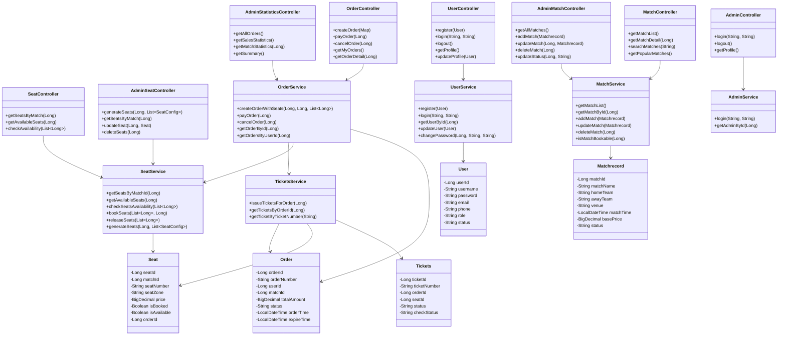
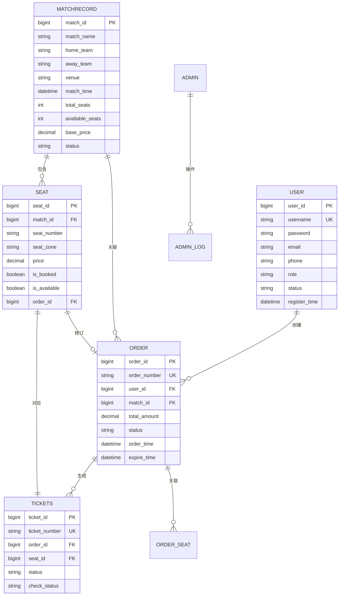

# 第四章 系统总体设计

## 3 系统总体设计

### 3.1 系统环境

#### 3.1.1 系统开发环境

本系统采用前后端分离架构，开发环境配置如下：

**操作系统**：
- Windows 10/11 或 Linux Ubuntu 20.04+
- macOS 12.0+

**后端开发环境**：
- **JDK版本**：JDK 17
- **开发工具**：IntelliJ IDEA 2023.1+ 或 Eclipse 2023-03+
- **构建工具**：Maven 3.6+
- **框架版本**：
  - Spring Boot 3.1.6
  - Spring Security 6.1.5
  - MyBatis-Plus 3.5.5
- **数据库工具**：MySQL Workbench 8.0+ 或 Navicat for MySQL
- **API测试工具**：Postman 10.0+ 或 Apifox

**前端开发环境**：
- **Node.js版本**：Node.js 14.0+ 或 Node.js 16.0+
- **包管理工具**：npm 6.0+ 或 yarn 1.22+
- **开发工具**：Visual Studio Code 1.70+ 或 WebStorm 2023.1+
- **框架版本**：
  - Vue.js 3.2.13
  - Vue Router 4.0.3
  - Axios 1.13.2
  - Element Plus 2.13.1（可选）

**版本控制工具**：
- Git 2.30+
- GitHub / GitLab / Gitee

**其他工具**：
- **数据库**：MySQL 8.0.33
- **接口文档**：Swagger UI 或 Knife4j（可选）

#### 3.1.2 系统运行环境

**服务器环境**：
- **操作系统**：Linux（推荐CentOS 7+、Ubuntu 20.04+）或 Windows Server 2019+
- **Java运行环境**：JRE 17 或 JDK 17
- **Web服务器**：Spring Boot内嵌Tomcat（开发环境）或独立Tomcat 9.0+（生产环境）
- **数据库服务器**：MySQL 8.0.33+

**客户端环境**：
- **浏览器**：Chrome 90+、Firefox 88+、Safari 14+、Edge 90+
- **屏幕分辨率**：支持1920x1080及以上（PC）、768x1024（平板）、375x667及以上（手机）
- **网络**：支持HTTP/HTTPS协议

**硬件要求**：
- **服务器**：
  - CPU：2核及以上
  - 内存：4GB及以上
  - 硬盘：20GB及以上可用空间
- **客户端**：
  - CPU：双核及以上
  - 内存：2GB及以上
  - 网络：宽带连接

**部署环境**：
- **传统部署**：物理服务器或虚拟机
- **容器化部署**：Docker 20.10+、Docker Compose 1.29+
- **云平台部署**：阿里云、腾讯云、AWS等

### 3.2 系统体系结构

#### 3.2.1 系统总体架构

本系统采用前后端分离的三层架构模式，系统总体架构如下：

```
┌─────────────────────────────────────────────────────────────┐
│                      表现层 (Presentation Layer)             │
│  ┌──────────────┐  ┌──────────────┐  ┌──────────────┐   │
│  │ Vue.js用户端 │  │ Vue.js管理端 │  │   静态资源    │   │
│  │  (浏览器)    │  │  (浏览器)    │  │  (CSS/JS)    │   │
│  └──────┬───────┘  └──────┬───────┘  └──────┬───────┘   │
└─────────┼─────────────────┼─────────────────┼──────────────┘
          │                 │                 │
          │  HTTP/RESTful API (JSON)          │
          │                 │                 │
┌─────────▼─────────────────▼─────────────────▼──────────────┐
│                   业务层 (Business Layer)                    │
│  ┌──────────────┐  ┌──────────────┐  ┌──────────────┐   │
│  │ Controller层 │  │  Service层   │  │   Mapper层   │   │
│  │  (API接口)   │  │  (业务逻辑)  │  │  (数据访问)  │   │
│  └──────┬───────┘  └──────┬───────┘  └──────┬───────┘   │
│         │                 │                 │             │
│  ┌──────▼─────────────────▼─────────────────▼───────┐   │
│  │         Spring Security (安全认证)                │   │
│  └───────────────────────────────────────────────────┘   │
└─────────┬───────────────────────────────────────────────┘
          │
          │ JDBC/MyBatis-Plus
          │
┌─────────▼───────────────────────────────────────────────┐
│                   数据层 (Data Layer)                    │
│  ┌──────────┐  ┌──────────┐  ┌──────────┐             │
│  │ user表   │  │ order表  │  │ seat表   │  ...        │
│  └──────────┘  └──────────┘  └──────────┘             │
└─────────────────────────────────────────────────────────┘
```

#### 3.2.2 系统功能结构图

根据功能需求分析，系统功能结构如下：

```
                    篮球票务销售系统
                           │
        ┌──────────────────┴──────────────────┐
        │                                      │
    用户端功能                            管理员端功能
        │                                      │
   ┌────┴────┐                          ┌────┴────┐
   │         │                          │         │
用户认证  业务功能                  管理员认证  管理功能
   │         │                          │         │
   │    ┌────┴────┐                     │    ┌────┴────┐
   │    │         │                     │    │         │
   │ 赛事浏览  购票管理              赛事管理  座位管理
   │    │         │                     │    │         │
   │    │    ┌────┴────┐                │    │         │
   │    │    │         │                │    │    ┌───┴───┐
   │    │ 选座购票  订单管理            │    │ 生成座位  统计
   │    │    │         │                │    │    │       │
   │    │    │    ┌────┴────┐           │    │    │   ┌───┴───┐
   │    │    │    │         │           │    │    │ 销售统计 订单统计
   │    │    │ 创建订单  支付订单       │    │    │
   │    │    │    │         │           │    │    │
   │    │    │    │    ┌────┴────┐      │    │    │
   │    │    │    │    │         │      │    │    │
   │    │    │    │ 取消订单  查看订单  │    │    │
```

**功能模块说明**：

1. **用户端功能**：
   - **用户认证**：用户注册、登录、登出、个人信息管理
   - **赛事浏览**：赛事列表、赛事详情、赛事搜索、热门赛事
   - **选座购票**：在线选座、创建订单、支付订单
   - **订单管理**：查看订单列表、订单详情、取消订单

2. **管理员端功能**：
   - **管理员认证**：管理员登录、登出
   - **赛事管理**：新增赛事、编辑赛事、删除赛事、更新赛事状态
   - **座位管理**：批量生成座位、编辑座位、删除座位
   - **统计功能**：销售统计、订单统计、赛事统计

#### 3.2.3 系统类图

采用面向对象设计方法，系统主要类图如下：



**类说明**：

1. **Controller层**：负责接收HTTP请求，调用Service层，返回响应
   - UserController：用户认证相关接口
   - MatchController：赛事浏览相关接口
   - SeatController：座位查询相关接口
   - OrderController：订单管理相关接口
   - AdminController：管理员认证相关接口
   - AdminMatchController：赛事管理相关接口
   - AdminSeatController：座位管理相关接口
   - AdminStatisticsController：统计相关接口

2. **Service层**：负责实现业务逻辑，处理事务
   - UserService：用户业务逻辑
   - MatchService：赛事业务逻辑
   - SeatService：座位业务逻辑
   - OrderService：订单业务逻辑（核心）
   - TicketsService：电子票业务逻辑
   - AdminService：管理员业务逻辑

3. **Entity层**：实体类，对应数据库表
   - User：用户实体
   - Matchrecord：赛事实体
   - Seat：座位实体
   - Order：订单实体
   - Tickets：电子票实体

### 3.3 系统功能设计

#### 3.3.1 用户认证模块设计

**功能描述**：处理用户注册、登录、登出等认证相关功能

**数据流图（DFD）**：

```
                    ┌─────────────┐
                    │    用户      │
                    └──────┬──────┘
                           │
        ┌──────────────────┼──────────────────┐
        │                  │                  │
        ▼                  ▼                  ▼
   ┌────────┐        ┌────────┐        ┌────────┐
   │用户注册│        │用户登录│        │个人信息│
   └───┬────┘        └───┬────┘        └───┬────┘
       │                 │                 │
       │                 │                 │
   ┌───▼─────────────────▼─────────────────▼────┐
   │          UserService (业务逻辑)            │
   └───┬─────────────────┬─────────────────┬────┘
       │                 │                 │
       │                 │                 │
   ┌───▼─────────────────▼─────────────────▼────┐
   │          UserMapper (数据访问)             │
   └───┬─────────────────┬─────────────────┬────┘
       │                 │                 │
       │                 │                 │
   ┌───▼─────────────────▼─────────────────▼────┐
   │            MySQL数据库 (user表)             │
   └────────────────────────────────────────────┘
```

**处理流程**：

1. **用户注册流程**：
   - 用户输入注册信息 → UserController接收请求
   - UserService验证用户名和邮箱唯一性
   - UserService使用BCrypt加密密码
   - UserMapper插入用户记录到数据库
   - 返回注册结果

2. **用户登录流程**：
   - 用户输入用户名和密码 → UserController接收请求
   - UserService查询用户信息
   - UserService验证密码（BCrypt）
   - 创建Session会话
   - 更新最后登录时间
   - 返回登录结果

#### 3.3.2 选座购票模块设计

**功能描述**：处理在线选座、下单、支付等核心功能

**数据流图（DFD）**：

```
                    ┌─────────────┐
                    │    用户      │
                    └──────┬──────┘
                           │
        ┌──────────────────┼──────────────────┐
        │                  │                  │
        ▼                  ▼                  ▼
   ┌────────┐        ┌────────┐        ┌────────┐
   │查看座位│        │创建订单│        │支付订单│
   └───┬────┘        └───┬────┘        └───┬────┘
       │                 │                 │
       │                 │                 │
   ┌───▼─────────────────▼─────────────────▼────┐
   │      SeatService    OrderService           │
   │      (座位业务)     (订单业务)             │
   └───┬─────────────────┬─────────────────┬────┘
       │                 │                 │
       │                 │                 │
   ┌───▼─────────────────▼─────────────────▼────┐
   │   SeatMapper    OrderMapper  TicketsMapper  │
   │   (座位访问)    (订单访问)   (票务访问)     │
   └───┬─────────────────┬─────────────────┬────┘
       │                 │                 │
       │                 │                 │
   ┌───┴─────────────────┴─────────────────┴───┐
   │  seat表    orders表    tickets表            │
   └────────────────────────────────────────────┘
```

**处理流程**：

1. **选座流程**：
   - 用户选择赛事 → SeatController接收请求
   - SeatService查询该赛事的座位列表
   - SeatMapper从数据库查询座位数据
   - 返回座位列表给前端，前端展示座位图

2. **创建订单流程**：
   - 用户选择座位，点击下单 → OrderController接收请求
   - OrderService检查座位可用性（防重复购票）
   - OrderService创建订单（事务开始）
   - OrderMapper插入订单记录
   - SeatService锁定座位（更新is_booked和order_id）
   - SeatMapper更新座位状态
   - 事务提交
   - 返回订单信息

3. **支付订单流程**：
   - 用户确认支付 → OrderController接收请求
   - OrderService验证订单状态和过期时间
   - OrderService更新订单状态为"已支付"（事务开始）
   - OrderMapper更新订单
   - TicketsService生成电子票
   - TicketsMapper插入票务记录
   - MatchService更新赛事可用座位数
   - 事务提交
   - 返回支付成功

**程序流程图（创建订单）**：

```
开始
  │
  ▼
接收用户请求（matchId, seatIds）
  │
  ▼
验证用户登录状态
  │
  ├─ 未登录 → 返回错误，结束
  │
  ▼
验证赛事是否存在且可预订
  │
  ├─ 不可预订 → 返回错误，结束
  │
  ▼
检查座位可用性（业务层）
  │
  ├─ 座位不可用 → 返回错误，结束
  │
  ▼
开始事务
  │
  ▼
计算订单总金额
  │
  ▼
生成订单号
  │
  ▼
创建订单记录
  │
  ├─ 创建失败 → 回滚事务，返回错误，结束
  │
  ▼
锁定座位（更新is_booked和order_id）
  │
  ├─ 锁定失败 → 回滚事务，返回错误，结束
  │
  ▼
提交事务
  │
  ▼
返回订单信息
  │
结束
```

#### 3.3.3 赛事管理模块设计

**功能描述**：处理赛事浏览、搜索等功能

**数据流图（DFD）**：

```
                    ┌─────────────┐
                    │    用户      │
                    └──────┬──────┘
                           │
        ┌──────────────────┼──────────────────┐
        │                  │                  │
        ▼                  ▼                  ▼
   ┌────────┐        ┌────────┐        ┌────────┐
   │赛事列表│        │赛事详情│        │搜索赛事│
   └───┬────┘        └───┬────┘        └───┬────┘
       │                 │                 │
       │                 │                 │
   ┌───▼─────────────────▼─────────────────▼────┐
   │          MatchService (业务逻辑)            │
   └───┬─────────────────┬─────────────────┬────┘
       │                 │                 │
       │                 │                 │
   ┌───▼─────────────────▼─────────────────▼────┐
   │        MatchrecordMapper (数据访问)           │
   └───┬─────────────────┬─────────────────┬────┘
       │                 │                 │
       │                 │                 │
   ┌───▼─────────────────▼─────────────────▼────┐
   │        MySQL数据库 (matchrecord表)           │
   └────────────────────────────────────────────┘
```

**处理流程**：

1. **赛事列表查询**：
   - 用户访问赛事列表 → MatchController接收请求
   - MatchService查询赛事列表（支持分页和筛选）
   - MatchrecordMapper从数据库查询
   - 返回赛事列表

2. **赛事搜索**：
   - 用户输入关键词 → MatchController接收请求
   - MatchService根据关键词搜索（赛事名称、球队、场馆）
   - MatchrecordMapper执行模糊查询
   - 返回搜索结果

#### 3.3.4 管理员管理模块设计

**功能描述**：处理管理员后台管理功能

**数据流图（DFD）**：

```
                    ┌─────────────┐
                    │   管理员    │
                    └──────┬──────┘
                           │
        ┌───────────────────┼───────────────────┐
        │                   │                 │
        ▼                   ▼                 ▼
   ┌────────┐        ┌─────────────┐   ┌────────┐
   │管理赛事│        │  管理座位   │   │查看统计│
   └───┬────┘        └───┬─────────┘   └───┬────┘
       │                 │                 │
       │                 │                 │
   ┌───▼─────────────────▼─────────────────▼────┐
   │  MatchService  SeatService  OrderService   │
   │  (赛事业务)    (座位业务)   (订单业务)      │
   └───┬─────────────────┬─────────────────┬────┘
       │                 │                 │
       │                 │                 │
   ┌───▼─────────────────▼─────────────────▼────┐
   │ MatchrecordMapper SeatMapper OrderMapper   │
   │  (赛事访问)      (座位访问)  (订单访问)     │
   └───┬─────────────────┬─────────────────┬────┘
       │                 │                 │
       │                 │                 │
   ┌───┴─────────────────┴─────────────────┴───┐
   │ matchrecord表  seat表  orders表           │
   └────────────────────────────────────────────┘
```

**处理流程**：

1. **批量生成座位流程**：
   - 管理员配置区域信息 → AdminSeatController接收请求
   - SeatService批量生成座位（事务开始）
   - SeatMapper批量插入座位记录
   - MatchService更新赛事可用座位数
   - MatchrecordMapper更新赛事记录
   - 事务提交
   - 返回生成结果

2. **销售统计流程**：
   - 管理员查看统计 → AdminStatisticsController接收请求
   - OrderService统计订单数据
   - OrderMapper执行统计查询（SUM、COUNT等）
   - 返回统计数据

### 3.4 系统界面设计

#### 3.4.1 用户端界面设计

**3.4.1.1 用户登录界面**

- **布局**：居中布局，简洁美观
- **元素**：
  - 系统标题/Logo
  - 用户名输入框
  - 密码输入框
  - "登录"按钮
  - "注册"链接
- **交互**：输入验证、错误提示、登录成功后跳转

**3.4.1.2 赛事列表界面**

- **布局**：响应式网格布局
- **元素**：
  - 搜索框（顶部）
  - 状态筛选标签（全部/即将开始/进行中/已结束）
  - 赛事卡片列表（每张卡片显示：对阵、时间、场馆、票价、可用座位）
  - 分页组件（底部）
- **交互**：点击卡片查看详情、点击"立即购票"进入选座页

**3.4.1.3 选座界面**

- **布局**：左右分栏布局
  - 左侧：座位图（按区域展示）
  - 右侧：已选座位列表和结算信息
- **元素**：
  - 座位图例（可选/已选/已售/不可用）
  - 区域筛选下拉框
  - 座位图（座位用不同颜色表示状态）
  - 已选座位列表
  - 总金额显示
  - "确认选座并下单"按钮
- **交互**：
  - 点击座位选择/取消选择
  - 实时更新已选座位列表
  - 实时计算总金额
  - 下单前再次检查座位可用性

**3.4.1.4 订单确认界面**

- **布局**：垂直布局，信息清晰
- **元素**：
  - 赛事信息展示
  - 已选座位列表（区域、座位号、类型、价格）
  - 订单金额
  - 支付方式选择（支付宝/微信/银行卡）
  - "确认支付"按钮
- **交互**：选择支付方式、确认支付、支付成功后跳转

**3.4.1.5 我的订单界面**

- **布局**：列表布局
- **元素**：
  - 状态筛选标签（全部/待支付/已支付/已取消）
  - 订单列表（每项显示：订单号、下单时间、状态、金额、座位数量）
  - 订单操作按钮（查看详情/立即支付/取消订单）
- **交互**：点击订单查看详情、待支付订单可以支付或取消

#### 3.4.2 管理员端界面设计

**3.4.2.1 管理员登录界面**

- **布局**：居中布局，与用户登录界面类似
- **元素**：
  - 管理员登录标题
  - 账号输入框
  - 密码输入框
  - "登录"按钮
- **交互**：登录成功后跳转到管理后台

**3.4.2.2 管理后台首页**

- **布局**：卡片式布局
- **元素**：
  - 数据统计卡片（总赛事数、总订单数、总销售额、已售票数）
  - 导航菜单（数据概览、赛事管理、座位管理、订单管理）
  - 退出登录按钮
- **交互**：点击菜单跳转到对应管理页面

**3.4.2.3 赛事管理界面**

- **布局**：表格布局
- **元素**：
  - "新增赛事"按钮
  - 赛事列表表格（赛事名称、对阵、时间、状态、操作）
  - 操作按钮（编辑/删除/更新状态）
- **交互**：新增、编辑、删除赛事，更新赛事状态

**3.4.2.4 座位管理界面**

- **布局**：表单+表格布局
- **元素**：
  - 赛事选择下拉框
  - 批量生成座位表单（区域配置）
  - 座位列表表格（座位号、区域、类型、价格、状态）
  - 操作按钮（编辑/删除）
- **交互**：选择赛事、批量生成座位、编辑单个座位

**3.4.2.5 订单统计界面**

- **布局**：统计卡片+表格布局
- **元素**：
  - 统计卡片（总销售额、订单数、票数）
  - 订单列表表格（订单号、用户、赛事、金额、状态）
  - 筛选条件（状态、时间范围）
- **交互**：查看统计数据、筛选订单、查看订单详情

#### 3.4.3 界面设计原则

1. **简洁美观**：界面设计简洁，符合现代Web设计规范
2. **易于操作**：操作流程清晰，减少用户操作步骤
3. **响应式设计**：适配不同屏幕尺寸（PC、平板、手机）
4. **一致性**：保持界面风格一致，使用统一的颜色和字体
5. **反馈及时**：用户操作后立即显示反馈信息

### 3.5 数据库设计

#### 3.5.1 数据库概念设计（ER图）

系统主要实体及关系如下：



**实体关系说明**：

1. **用户（USER）与订单（ORDER）**：一对多关系，一个用户可以创建多个订单
2. **赛事（MATCHRECORD）与座位（SEAT）**：一对多关系，一个赛事包含多个座位
3. **赛事（MATCHRECORD）与订单（ORDER）**：一对多关系，一个赛事可以关联多个订单
4. **订单（ORDER）与电子票（TICKETS）**：一对多关系，一个订单可以生成多张电子票
5. **座位（SEAT）与订单（ORDER）**：多对一关系，一个座位只能被一个订单预订
6. **座位（SEAT）与电子票（TICKETS）**：一对一关系，一个座位对应一张电子票

#### 3.5.2 数据库逻辑设计（表结构）

**3.5.2.1 用户表（user）**

| 字段名 | 类型 | 长度 | 是否为空 | 主键 | 说明 |
|--------|------|------|---------|------|------|
| user_id | BIGINT | - | NOT NULL | 是 | 用户ID，自增 |
| username | VARCHAR | 50 | NOT NULL | 否 | 用户名，唯一 |
| password | VARCHAR | 255 | NOT NULL | 否 | 密码（BCrypt加密） |
| email | VARCHAR | 100 | NULL | 否 | 邮箱 |
| phone | VARCHAR | 20 | NULL | 否 | 手机号 |
| real_name | VARCHAR | 50 | NULL | 否 | 真实姓名 |
| role | VARCHAR | 20 | NOT NULL | 否 | 用户角色（USER/ADMIN） |
| status | VARCHAR | 20 | NOT NULL | 否 | 账号状态（ACTIVE/BANNED） |
| register_time | DATETIME | - | NULL | 否 | 注册时间 |
| last_login_time | DATETIME | - | NULL | 否 | 最后登录时间 |
| create_time | DATETIME | - | NULL | 否 | 创建时间 |
| update_time | DATETIME | - | NULL | 否 | 更新时间 |

**索引**：
- PRIMARY KEY (user_id)
- UNIQUE KEY uk_username (username)
- KEY idx_email (email)
- KEY idx_status (status)

**3.5.2.2 赛事表（matchrecord）**

| 字段名 | 类型 | 长度 | 是否为空 | 主键 | 说明 |
|--------|------|------|---------|------|------|
| match_id | BIGINT | - | NOT NULL | 是 | 赛事ID，自增 |
| match_name | VARCHAR | 200 | NOT NULL | 否 | 赛事名称 |
| home_team | VARCHAR | 100 | NOT NULL | 否 | 主队 |
| away_team | VARCHAR | 100 | NOT NULL | 否 | 客队 |
| venue | VARCHAR | 100 | NULL | 否 | 比赛场馆 |
| match_time | DATETIME | - | NOT NULL | 否 | 比赛时间 |
| description | TEXT | - | NULL | 否 | 赛事描述 |
| total_seats | INT | - | NOT NULL | 否 | 总座位数 |
| available_seats | INT | - | NOT NULL | 否 | 可用座位数 |
| base_price | DECIMAL | 10,2 | NOT NULL | 否 | 基础票价 |
| status | VARCHAR | 20 | NOT NULL | 否 | 赛事状态（UPCOMING/ONGOING/FINISHED/CANCELLED） |
| create_time | DATETIME | - | NULL | 否 | 创建时间 |
| update_time | DATETIME | - | NULL | 否 | 更新时间 |

**索引**：
- PRIMARY KEY (match_id)
- KEY idx_match_time (match_time)
- KEY idx_status (status)
- KEY idx_venue (venue)

**3.5.2.3 座位表（seat）**

| 字段名 | 类型 | 长度 | 是否为空 | 主键 | 说明 |
|--------|------|------|---------|------|------|
| seat_id | BIGINT | - | NOT NULL | 是 | 座位ID，自增 |
| match_id | BIGINT | - | NOT NULL | 否 | 赛事ID，外键 |
| seat_number | VARCHAR | 50 | NOT NULL | 否 | 座位号 |
| seat_zone | VARCHAR | 20 | NULL | 否 | 区域 |
| seat_row | INT | - | NULL | 否 | 排号 |
| seat_col | INT | - | NULL | 否 | 列号 |
| seat_type | VARCHAR | 20 | NOT NULL | 否 | 座位类型（VIP/PREMIUM/STANDARD） |
| price | DECIMAL | 10,2 | NOT NULL | 否 | 实际价格 |
| is_booked | TINYINT | 1 | NOT NULL | 否 | 是否已预订（0-未预订，1-已预订） |
| is_available | TINYINT | 1 | NOT NULL | 否 | 是否可用（0-不可用，1-可用） |
| order_id | BIGINT | - | NULL | 否 | 订单ID，外键 |
| create_time | DATETIME | - | NULL | 否 | 创建时间 |
| update_time | DATETIME | - | NULL | 否 | 更新时间 |

**索引**：
- PRIMARY KEY (seat_id)
- KEY idx_match_id (match_id)
- KEY idx_order_id (order_id)
- KEY idx_match_seat_number (match_id, seat_number)
- KEY idx_match_zone_row_col (match_id, seat_zone, seat_row, seat_col)
- KEY idx_available_booked (is_available, is_booked)
- FOREIGN KEY fk_seat_match (match_id) REFERENCES matchrecord(match_id)
- FOREIGN KEY fk_seat_order (order_id) REFERENCES orders(order_id)

**3.5.2.4 订单表（orders）**

| 字段名 | 类型 | 长度 | 是否为空 | 主键 | 说明 |
|--------|------|------|---------|------|------|
| order_id | BIGINT | - | NOT NULL | 是 | 订单ID，自增 |
| order_number | VARCHAR | 50 | NOT NULL | 否 | 订单编号，唯一 |
| user_id | BIGINT | - | NOT NULL | 否 | 用户ID，外键 |
| match_id | BIGINT | - | NOT NULL | 否 | 赛事ID，外键 |
| total_amount | DECIMAL | 10,2 | NOT NULL | 否 | 订单总金额 |
| actual_amount | DECIMAL | 10,2 | NULL | 否 | 实际支付金额 |
| seat_count | INT | - | NOT NULL | 否 | 座位数量 |
| order_time | DATETIME | - | NULL | 否 | 下单时间 |
| pay_time | DATETIME | - | NULL | 否 | 支付时间 |
| expire_time | DATETIME | - | NULL | 否 | 订单过期时间 |
| status | VARCHAR | 20 | NOT NULL | 否 | 订单状态（PENDING/PAID/CANCELLED/REFUNDED/EXPIRED） |
| pay_method | VARCHAR | 20 | NULL | 否 | 支付方式 |
| transaction_id | VARCHAR | 100 | NULL | 否 | 支付交易号 |
| create_time | DATETIME | - | NULL | 否 | 创建时间 |
| update_time | DATETIME | - | NULL | 否 | 更新时间 |

**索引**：
- PRIMARY KEY (order_id)
- UNIQUE KEY uk_order_number (order_number)
- KEY idx_user_id (user_id)
- KEY idx_match_id (match_id)
- KEY idx_status (status)
- KEY idx_user_status (user_id, status)
- FOREIGN KEY fk_order_user (user_id) REFERENCES user(user_id)
- FOREIGN KEY fk_order_match (match_id) REFERENCES matchrecord(match_id)

**3.5.2.5 电子票表（tickets）**

| 字段名 | 类型 | 长度 | 是否为空 | 主键 | 说明 |
|--------|------|------|---------|------|------|
| ticket_id | BIGINT | - | NOT NULL | 是 | 电子票ID，自增 |
| ticket_number | VARCHAR | 50 | NOT NULL | 否 | 票号，唯一 |
| order_id | BIGINT | - | NOT NULL | 否 | 订单ID，外键 |
| seat_id | BIGINT | - | NOT NULL | 否 | 座位ID，外键 |
| qr_code | VARCHAR | 500 | NULL | 否 | 二维码数据 |
| check_status | VARCHAR | 20 | NOT NULL | 否 | 检票状态（UNCHECKED/CHECKED） |
| check_time | DATETIME | - | NULL | 否 | 检票时间 |
| check_operator | VARCHAR | 50 | NULL | 否 | 检票操作员 |
| issue_time | DATETIME | - | NULL | 否 | 出票时间 |
| status | VARCHAR | 20 | NOT NULL | 否 | 票状态（VALID/USED/REFUNDED/EXPIRED） |
| create_time | DATETIME | - | NULL | 否 | 创建时间 |
| update_time | DATETIME | - | NULL | 否 | 更新时间 |

**索引**：
- PRIMARY KEY (ticket_id)
- UNIQUE KEY uk_ticket_number (ticket_number)
- KEY idx_order_id (order_id)
- KEY idx_seat_id (seat_id)
- KEY idx_check_status (check_status)
- KEY idx_status (status)
- FOREIGN KEY fk_ticket_order (order_id) REFERENCES orders(order_id)
- FOREIGN KEY fk_ticket_seat (seat_id) REFERENCES seat(seat_id)

#### 3.5.3 数据库物理设计（索引设计）

**索引设计原则**：

1. **主键索引**：所有表都有主键，使用自增BIGINT类型
2. **唯一索引**：对唯一性字段建立唯一索引（如username、order_number）
3. **普通索引**：对经常用于查询和筛选的字段建立索引
4. **复合索引**：对经常组合查询的字段建立复合索引

**关键索引说明**：

1. **seat表的索引**：
   - `idx_match_id`：查询某赛事的座位（最频繁的查询）
   - `idx_available_booked`：查询可用座位（`is_available=1 AND is_booked=0`）
   - `idx_match_zone_row_col`：按区域、排、列排序展示座位图

2. **orders表的索引**：
   - `idx_user_id`：用户查询自己的订单（高频查询）
   - `idx_user_status`：用户查询特定状态的订单（如待支付订单）
   - `idx_status`：按状态筛选订单（管理端统计）

3. **matchrecord表的索引**：
   - `idx_match_time`：按时间排序展示赛事列表
   - `idx_status`：筛选即将开始的比赛

---

**本章小结**：本章详细设计了系统的总体架构，包括系统环境配置、系统体系结构、功能模块设计、界面设计和数据库设计。系统采用前后端分离的三层架构，功能模块划分清晰，数据库设计合理，为系统的实现提供了设计基础。
